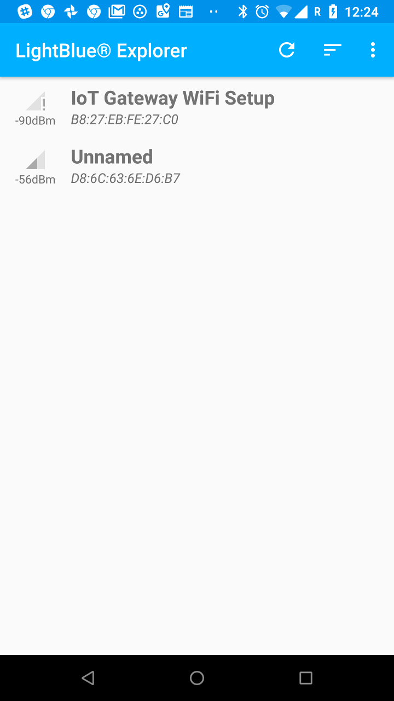

# Setup As A Service
The SamsungBluetoothWiFiManager can be run as a service on the raspberry pi. This means that it can startup automatically 
every time your system is boot. The standard way to do this on a Linux system is using systemd. Information on this can be found here:

https://www.linux.com/learn/understanding-and-using-systemd

The Samsung Bluetooth WiFi Manager has a service configuration script which can be used to setup your system to do this. Follow the installation and setup steps below.

## Copy Your Service Profile
You need to copy the service profile script to the /etc/systemd/system dir as an admin (root) user:

     /> sudo cp config/bluetooth-wifi-manager.service /etc/systemd/system/
     
## Enable Your New Service
Once the new service profile is copied into the 'unit' systemd directory you need to set permissions on the file and enable it. To do this do:

     /> sudo chmod 664 /etc/systemd/system/bluetooth-wifi-manager.service
     /> systemctl daemon-reload

## Start Your New Bluetooth WiFi Manager Service
You can now start the service from the command line and check it's working. First check the 'Status' and then 'Start' the service:
First Check Status:

     />  sudo service bluetooth-wifi-manager status
     ● bluetooth-wifi-manager.service - Bluetooth WiFi Manager Service
       Loaded: loaded (/etc/systemd/system/bluetooth-wifi-manager.service; disabled; vendor preset: enabled)
       Active: inactive (dead)

     Jul ** 11:13:26 raspberrypi systemd[1]: Stopping Bluetooth WiFi Manager Service...
     Jul ** 11:13:26 raspberrypi systemd[1]: Stopped Bluetooth WiFi Manager Service.

To Start the service you can do:

     /> sudo service bluetooth-wifi-manager start
     
Simply check the status again to see that it's running:

     /> sudo service bluetooth-wifi-manager status
       ● bluetooth-wifi-manager.service - Bluetooth WiFi Manager Service
         Loaded: loaded (/etc/systemd/system/bluetooth-wifi-manager.service; disabled; vendor preset: enabled)
         Active: active (running) since Fri 2018-07-06 11:15:16 BST; 51s ago
         Main PID: 3062 (node)
         CGroup: /system.slice/bluetooth-wifi-manager.service
                └─3062 /usr/bin/node /home/pi/samsung/SamsungBluetoothWiFiManager/bleno/bluetooth-wifi-manager/bluetooth-wifi-manager.js > /home/pi/samsung/blueto$

## Checking Via Your Mobile For A Running Service
To verify that your bluetooth wifi manager service is running via a mobile use a low energy bluetooth application like Lightblue Explorer:

https://play.google.com/store/apps/details?id=com.punchthrough.lightblueexplorer

Launch the application and scan for bluetooth devices. You should see a bluetooth device called 'IoT Gateway WiFi Setup'.

