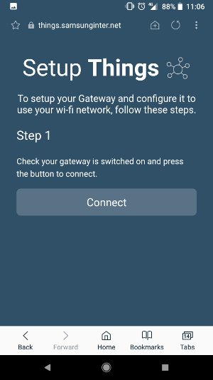

# SetupThings: A Web Application for initialising a Mozilla Things Gateway over Bluetooth

This is a web application that you can use to connect with a
[Mozilla Project Things Gateway](https://iot.mozilla.org/gateway/)
running the experimental [Samsung Bluetooth WiFi Manager](https://github.com/nherriot/SamsungBluetoothWiFiManager), in order to set the
Gateway up on your wifi network.



It uses Web Bluetooth to communicate with the Gateway, before it is set up on your
wifi network. You can select your wifi network and submit the password for it. 
Once the Gateway is set up on your wifi, the web app will redirect to the Gateway 
service running on your local network.

This is an alternative approach to the Gateway providing its own wifi hotspot that
you need to connect to first. The theory is that this approach may be an improvement 
because:

* Pairing with the Gateway using a simple Bluetooth prompt may be more intutitive 
to users.

* Connecting to a wifi network from scratch may be quicker than tearing down the
wifi hotspot first and then connecting.

* It is easy to share this setup app via a URL, since it is available on the web.

## Usage

This project is _in development and experimental_. You can test it out at [https://things.samsunginter.net](https://things.samsunginter.net). You will need
[a device and browser which supports the Web Bluetooth standard](https://github.com/WebBluetoothCG/web-bluetooth/blob/master/implementation-status.md).

The application is a [Progressive Web App](https://developer.mozilla.org/en-US/Apps/Progressive), 
which means that using supported mobile browsers, you can add it to your homescreen 
and launch it in a standalone window, like a native mobile app. Once loaded, it should 
be cached and ready to use offline.

## Development

This web app was developed using [Svelte](http://svelte.technology/) and [Sapper](https://sapper.svelte.technology/). 
You can read [more about them and the motivation for using them here](https://medium.com/samsung-internet-dev/disappearing-frameworks-ed921f411c38). 
Sapper uses a [Node](https://nodejs.org/en/) server for development.

To run this web app locally, clone this repository and run `npm install`. Then:

```
npm run dev
```

The site should now be accessible at [http://localhost:3000](http://localhost:3000).

When you make changes, the site should be re-built automatically.

The Sapper docs include guides for [deploying](https://sapper.svelte.technology/guide#deploying) and [exporting a static version of the site](https://sapper.svelte.technology/guide#exporting).

## Remote Debugging

Using the web app on a mobile phone is often useful, for example for cross-device testing and especially if you do not have Web Bluetooth capable browser on your laptop. To debug the web app on your phone, from your laptop, you can use Remote Debugging:

* Ensure that 'USB debugging' is enabled on your phone.
* Connect your phone to your laptop via USB.
* Switch the USB mode from 'charging' to 'file transfer' or 'media transfer'.
* In Chrome / Chromium on your laptop, visit the URL `chrome://inspect`.
* Your phone and its active pages should be displayed there.
* Click 'Inspect' on the appropriate page to launch the Dev Tools for it.
* You should be able to debug it now as though it was a page you were viewing locally in the browser on your laptop (for example, view the console).

See the [Chrome DevTools guide](https://developers.google.com/web/tools/chrome-devtools/) for more information.

The instructions above are suitable for accessing a deployed version of the website that you can access via a domain name. To access the local, development version running on your computer, you can also:

* Enable 'port forwarding' in the `chrome://inspect` settings, to forward your local development server's port (e.g. 3000).
* Then visit `localhost:[port number]` (e.g. `localhost:3000`) on your phone.

This is important for testing Web Bluetooth, because `localhost` counts as a secure origin, which means that Web Bluetooth is supported. Web Bluetooth will not be supported if you simply visit a local IP address via `http://` .
